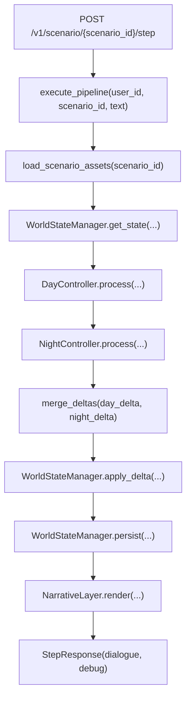
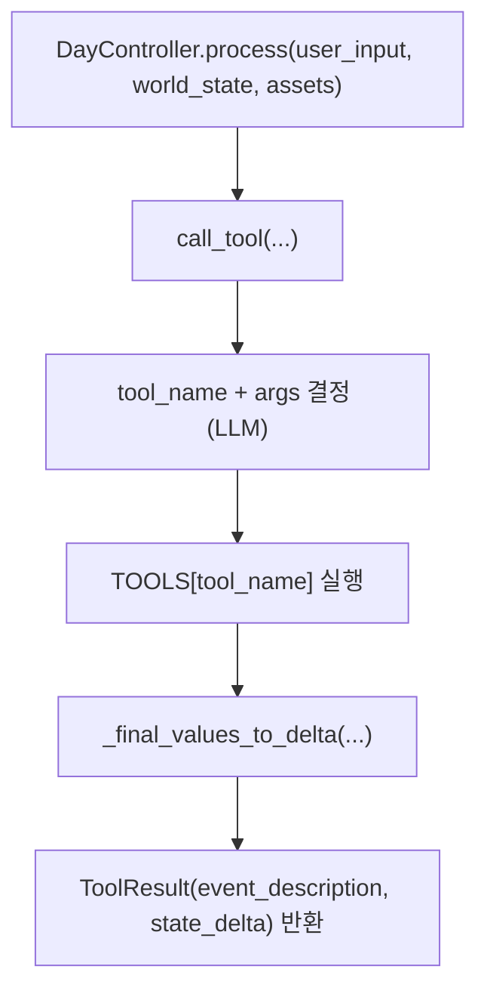
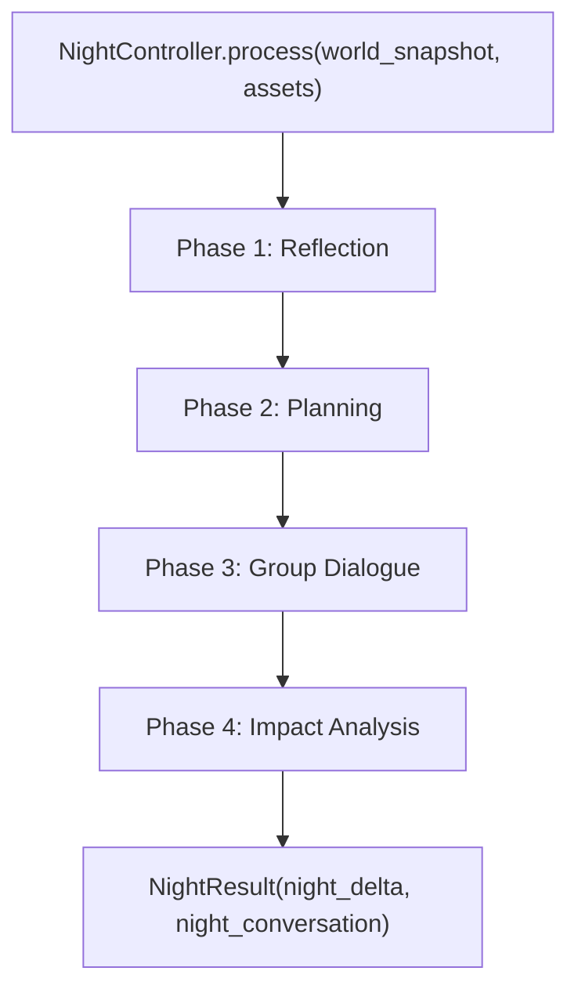
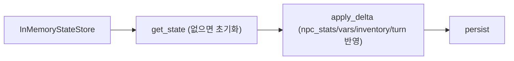

# app 전체 파이프라인

`demo-repository/app` 기준으로, 현재 코드 흐름을 한 번에 볼 수 있게 정리한 문서입니다.

## 1) API 1턴 처리 파이프라인 (`app/main.py`)

## 2) Day 파이프라인 상세 (`app/day_controller.py`, `app/tools.py`)

### Day 내부 Tool 분기

- `interact(target, interact)`: NPC 조회 → 메모리 검색(`agents/retrieval.py`) → 대화 프롬프트 생성 → LLM 응답 파싱
- `action(action)`: 행동 프롬프트 생성 → LLM 응답 파싱
- `use(item, action)`: 아이템/인벤토리 검증 → 아이템 프롬프트 생성 → LLM 응답 파싱

## 3) Night 파이프라인 상세 (`app/night_controller.py`, `app/agents/*`)

### Night 단계별 호출

- Reflection: `should_reflect` → `perform_reflection` (필요 시 메모리 추가)
- Planning: `update_plan` (장기/단기 계획 생성 및 저장)
- Dialogue: `_generate_utterance` 반복 + `store_dialogue_memories`
- Impact: `analyze_conversation_impact` 결과를 `night_delta["npc_stats"]`에 누적

## 4) 상태 관리 파이프라인 (`app/state.py`)

- 기본 저장소는 메모리(`InMemoryStateStore`)
- `apply_delta`는 숫자 스탯에 대해 누적(+delta) 반영
- NPC 스탯은 0~100 범위 클램프

## 5) 보조 실행 경로 (`app/game_loop.py`)

`GameLoop`는 API 없이 로컬 루프처럼 돌릴 수 있는 오케스트레이션입니다.

- `day_turn(user_input)`: `DayController.process` → 월드 상태 반영
- `night_phase()`: `NightController.process` → 월드 상태 반영
- `check_ending()`: 시나리오 ending 조건 평가

## 6) 파일 역할 요약

- `main.py`: FastAPI 엔트리 + 1턴 오케스트레이션
- `loader.py`: 시나리오 YAML 로드 (`ScenarioAssets`)
- `models.py`: 공통 데이터 모델 (`WorldState`, `ToolResult`, `NightResult`, `StateDelta`)
- `day_controller.py`: 낮 턴 컨트롤러 (tool calling + tool 실행)
- `tools.py`: Day tool 실제 구현 (`interact`, `action`, `use`)
- `night_controller.py`: 밤 턴 컨트롤러 (GA 4단계)
- `agents/*`: 메모리/검색/성찰/계획/대화 로직
- `state.py`: 상태 조회/적용/저장
- `narrative.py`: 최종 텍스트 렌더링
- `llm/*`: LLM 설정/엔진/프롬프트/응답 파서

## 7) 현재 코드 기준 확인 포인트

- `main.py`의 `NarrativeLayer.render(...)` 호출 인자와 `narrative.py`의 실제 시그니처가 다릅니다.
- `main.py`는 `night_result.night_dialogue`를 사용하지만, `NightResult` 필드는 `night_conversation`입니다.

위 2개는 실행 시점에서 인터페이스 정합성 점검이 필요한 부분입니다.
